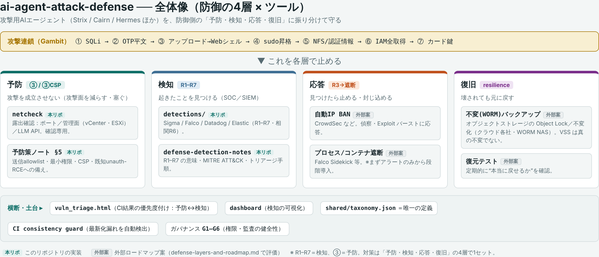

<!--
Suggested GitHub "About" (set in the repo page → About ⚙️):
  Defensive detection pack for autonomous AI-agent attacks — exposure checks,
  triage, and detection rules (R1–R7) mapped to MITRE ATT&CK. Authorized use only.
Suggested Topics:
  defensive-security detection-engineering ai-security blue-team threat-detection
  sigma falco siem llm-security security-tools
-->

# ai-agent-attack-defense

**An open, defensive detection pack for autonomous AI-agent attacks** — exposure checks, triage, and detection rules (**R1–R7**) mapped to **MITRE ATT&CK / ATLAS** and **OWASP Top 10 for LLM**, organized as *prevent → detect → respond → recover*. Detection/defense design only.

Study materials and small defensive tools based on the Gambit Security report (2026-09-22) on AI-agent attacks against online retailers (Strix / Cairn / Hermes).
Use these **only on systems you own or are authorized to test**.

> Big picture: countermeasures form one set across **prevent (③) → detect (R1–R7) → respond → recover**. See [`security-scan/defense-layers-and-roadmap.md`](security-scan/defense-layers-and-roadmap.md) for the mapping and [`security-scan/glossary.ja.md`](security-scan/glossary.ja.md) for plain-language term definitions.

| Path | What it is | How to test |
|---|---|---|
| `vuln_triage.html` | Browser page: load Semgrep / Trivy / gitleaks JSON, get priority, fixes and a plan. Runs locally, nothing is uploaded. Secrets are masked. | Open the file in a browser, drop a JSON report. |
| `.github/workflows/security-scan.yml` + `scripts/summarize.py` | CI scan set: Semgrep, Trivy, gitleaks (+ ZAP baseline if `STAGING_URL` is set). | See "CI scan" below. |
| `netcheck/` | Confirmation-only checker (ports, banners, headers, TLS, admin-like URLs) with a browser UI. Private ranges only by default. Cannot judge SQL injection. | `python3 netcheck/netcheck.py` then open the printed URL. |
| `deck/` | Generator scripts for the JP/EN slide decks (pptxgenjs). | See `deck/README.md`. |

## CI scan
1. Push to this repo; the workflow runs on push to `main`, pull requests, daily (18:17 UTC) and manually (Actions tab > security-scan > Run workflow).
2. Repo variables (Settings > Secrets and variables > Actions > Variables):
   - `FAIL_ON`: `none` (default), `critical`, `high`, `medium`, `low`, `secret`. Secrets always fail the run unless `none`.
   - `STAGING_URL`: a **staging** URL you own. Leave unset to skip ZAP. Never point it at production or third parties.
3. Results: job summary and the `security-scan-results` artifact (JSON). Feed those JSON files into `vuln_triage.html`.
4. Offline test of the summarizer: `python3 scripts/summarize.py <dir-with-json> --fail-on high`.
5. Ship scan results to a SIEM: `--format elastic --out scan.ndjson` (ECS NDJSON) or `--format datadog --out scan.json` (Datadog Logs JSON). This feeds CI findings into the same platform where the R1–R7 detection rules live.

## Status / unverified
- `summarize.py` and `netcheck.py` were tested locally (exit codes, refusals, a scan of 127.0.0.1).
- The GitHub Actions workflow has **not yet run on GitHub**; first-run issues (image pulls, ZAP permissions) are possible.
- Scanner output depends on the tools' versions; findings are leads, not proof.

---

# 日本語版（概要）

**自律型AIエージェント攻撃を“検知する”ためのオープンな防御パック**です。露出確認・トリアージ・検知ルール（**R1–R7**）を、**MITRE ATT&CK / ATLAS** と **OWASP Top 10 for LLM** に対応づけ、*予防→検知→応答→復旧* で整理しています。検知・防御の設計に限定。

Gambit Security レポート（2026-09-22）の、オンライン小売を狙った AI エージェント攻撃（Strix / Cairn / Hermes）を題材にした、**学習教材と小さな防御ツール**の集まりです。
**自分が所有している、または許可を得た対象にのみ使用してください。**

> 全体像：対策は「**予防(③) → 検知(R1–R7) → 応答 → 復旧**」の4層で1セットです。各対策の対応づけは [`security-scan/defense-layers-and-roadmap.md`](security-scan/defense-layers-and-roadmap.md)、用語のやさしい解説は [`security-scan/glossary.ja.md`](security-scan/glossary.ja.md) を参照。

## ツール一覧

| パス | 何か | 試し方 |
|---|---|---|
| `vuln_triage.html` | ブラウザで動くトリアージ画面。Semgrep / Trivy / gitleaks の JSON を読み込み、優先度・修正案・対応計画を表示。ローカル完結でアップロードなし、秘密情報はマスク。 | ファイルをブラウザで開き、JSON レポートをドロップ。 |
| `.github/workflows/security-scan.yml` + `scripts/summarize.py` | CI スキャン一式：Semgrep・Trivy・gitleaks（`STAGING_URL` を設定すれば ZAP ベースラインも）。 | 下の「CI スキャン」を参照。 |
| `netcheck/` | 確認専用のチェッカー（ポート・バナー・ヘッダ・TLS・管理画面らしき URL）。ブラウザ UI 付き。既定ではプライベート範囲のみ。SQL インジェクションの有無は判定しない。 | `python3 netcheck/netcheck.py` を実行し、表示された URL を開く。 |
| `deck/` | 日英スライドの生成スクリプト（pptxgenjs）。 | `deck/README.md` を参照。 |

## CI スキャン
1. このリポジトリに push すると、`main` への push・プルリクエスト・毎日（18:17 UTC）・手動（Actions タブ > security-scan > Run workflow）で動きます。
2. リポジトリ変数（Settings > Secrets and variables > Actions > Variables）：
   - `FAIL_ON`：`none`（既定）／`critical`／`high`／`medium`／`low`／`secret`。`none` 以外では秘密情報を検出すると必ず失敗。
   - `STAGING_URL`：自分が所有する**ステージング**の URL。未設定なら ZAP をスキップ。**本番や第三者には絶対に向けないこと。**
3. 結果：ジョブのサマリと `security-scan-results` アーティファクト（JSON）。その JSON を `vuln_triage.html` に読み込ませます。
4. 集計のオフライン実行：`python3 scripts/summarize.py <JSONのあるディレクトリ> --fail-on high`。

## security-scan/ — 防御研究一式（追加分）

AI エージェント攻撃ツール（Strix / Cairn / Hermes、および周辺の攻撃用 AI エージェント）を**防御・検知の観点で**まとめた一式です。**検知・防御の設計に限定**し、攻撃の実行手順や安全機構の回避方法は含みません。日本語の入口は [`security-scan/README.ja.md`](security-scan/README.ja.md)。

- **統合ダッシュボード** `security-scan/dashboard.html` … 攻撃エージェントの俯瞰・検知カバレッジ・予防策を1枚に（オフライン完結）。
- **防御・検知ノート** `security-scan/defense-detection-notes.md` … 偵察/侵入/統括の各段の観測点と、検知ルール R1–R7・MITRE ATT&CK 対応・トリアージ。
- **検知ルール** `security-scan/detections/` … Sigma / Falco / Datadog の実装（R1–R7）。
- **系統図** `security-scan/lineage.md` … 起点 URL →ツール要素→検知→防御のたどり（GitHub 上で図が描画されます）。
- **Cairn 認可ラボ** `security-scan/cairn-lab/` … 自分の隔離ラボで動かすためのランブックと設定（攻撃なし mock 検証つき）。
- **Strix ローカル実行 PoC** `security-scan/strix-local-poc/`。
- **CVP 対応** `security-scan/cvp-readiness.md` ＋申請パッケージ `security-scan/cvp-package/`。

## 状態・未検証
- `summarize.py` と `netcheck.py` はローカルで動作確認済み（終了コード・拒否動作・127.0.0.1 のスキャン）。
- GitHub Actions のワークフローは**まだ GitHub 上で実行していない**ため、初回特有の問題（イメージ取得、ZAP の権限）が起きる可能性があります。
- スキャナの出力はツールのバージョンに依存します。指摘は手がかりであって証拠ではありません。
