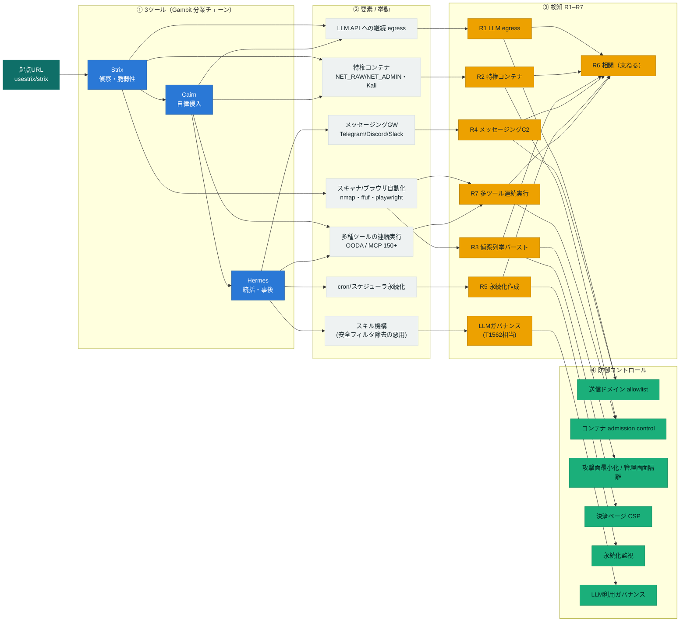
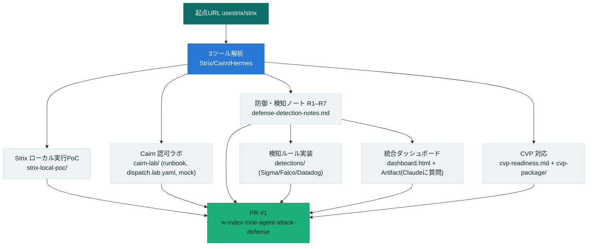

# 系統図 — URL からの派生（ツール要素 → 検知 → 防御）

起点は共有された **Strix の URL**。そこから 3 ツール（Strix/Cairn/Hermes）を読み込み、各ツールの
**要素/挙動**を**検知ルール R1–R7**と**防御コントロール**に結びつけた。本書はその派生をたどる系統図。
検知・防御の設計に限定。

起点: https://github.com/usestrix/strix
関連: [Cairn](https://github.com/oritera/Cairn) / [Hermes](https://github.com/NousResearch/hermes-agent)

## フロー図（ツール要素 → 検知 → 防御）

> 補足: ④E2E 自律型（PentAGI/Villager 等）・⑤攻撃基盤型（HexStrike 等）も同じ要素を持つため、
> 同じ検知（特に R7・R2・R1）が横展開で効く。ローカルLLM型は R1 を回避するため **R7/R2 に重心**。

## トレーサビリティ表（要素 → 検知 → 防御 → 成果物）

| ツール | 要素 / 挙動 | 検知 | 防御 | 本リポの成果物 |
|---|---|---|---|---|
| Strix | スキャナ/自動ブラウザ | R3, R7 | 攻撃面最小化, admission control | `detections/`（r3,r7）, `strix-local-*` |
| Strix | Docker サンドボックス | R2 | admission control | `strix-local-backend-notes.md` |
| Strix/Cairn/Hermes | LLM API egress | R1 | 送信ドメイン allowlist | `detections/`（r1）, `defense-detection-notes.md` |
| Cairn | 特権ワーカーコンテナ(NET_RAW) | R2 | admission control | `detections/`（r2, falco）, `cairn-lab/` |
| Cairn | OODA の多ツール実行 | R7 | admission control | `detections/`（r7）, `cairn-lab/`（mock検証） |
| Hermes | メッセージング GW | R4 | 送信ドメイン allowlist | `detections/`（r4） |
| Hermes | cron/永続化 | R5 | 永続化監視 | `detections/`（r5, falco） |
| Hermes | スキル（安全フィルタ除去の悪用） | ガバナンス(T1562) | LLM利用ガバナンス | `defense-detection-notes.md`（§6/注意） |
| 全体 | 連鎖（速く広い） | R6 相関 | SIEM 相関設計 | `defense-detection-notes.md`（R6）, `dashboard.html` |

## 成果物の系統（何がどこに結実したか）

---
検知・防御の設計に限定。攻撃の実行手順や安全機構の回避方法は含めない。
